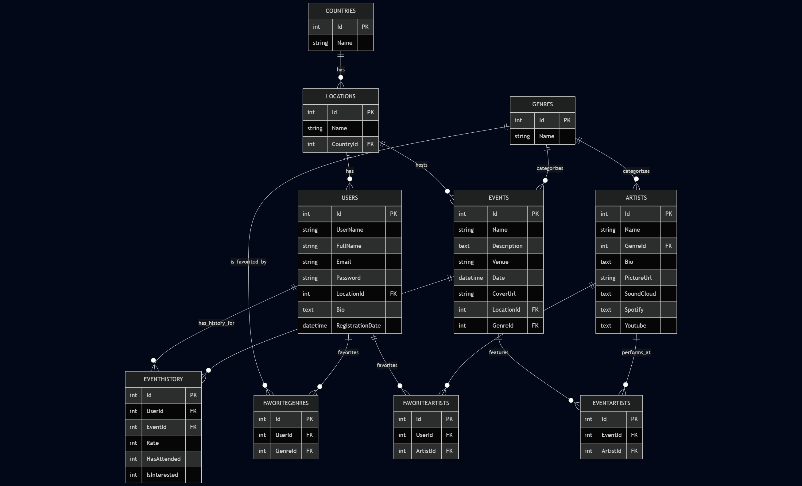

# TechnoPulse Analytics

## 📌 Company Overview
**TechnoPulse Analytics** is a fictional company specializing in analyzing electronic and techno music events around the world. Our mission is to provide deep insights into artist performances, event popularity, audience preferences, and genre trends by leveraging modern data analytics tools.

We focus on:
- Tracking event history and attendance.
- Analyzing artist profiles, genres, and global reach.
- Visualizing music industry trends through interactive dashboards.

---

## 📊 Project Description
This project processes the **Techno Music Events dataset** and provides insights into:
- Artist popularity and genre distribution.
- Event locations, attendance, and frequency.
- Streaming and social media influence of artists (SoundCloud, Spotify, YouTube).

The analytics is intended to support:
- Event organizers in making data-driven booking decisions.
- Music labels in identifying rising talent.
- Fans and communities interested in techno culture trends.

---

## 🖼️ Diagram
  


---

## ⚙️ How to Run the Project

1. **Clone the Repository**
   ```bash
   git clone https://github.com/yourusername/technopulse-analytics.git
   cd technopulse-analytics
   ```

2. **Install Dependencies**
   Make sure you have Python 3.10+ installed, then run:
   ```bash
   pip install -r requirements.txt
   ```
3. **Run script**
   ```bash
   python main.py
   ```

---

## 🛠️ Tools & Resources

- **Languages & Frameworks**:  
  - Python (Pandas, NumPy, Matplotlib, Seaborn, Plotly)    
  - SQL (PostgreSQL for database management)
  - Apache Superset

- **Data Source**:  
  - [Kaggle: Techno Music Events Dataset](https://www.kaggle.com/datasets/alesde/techno-music-events)
